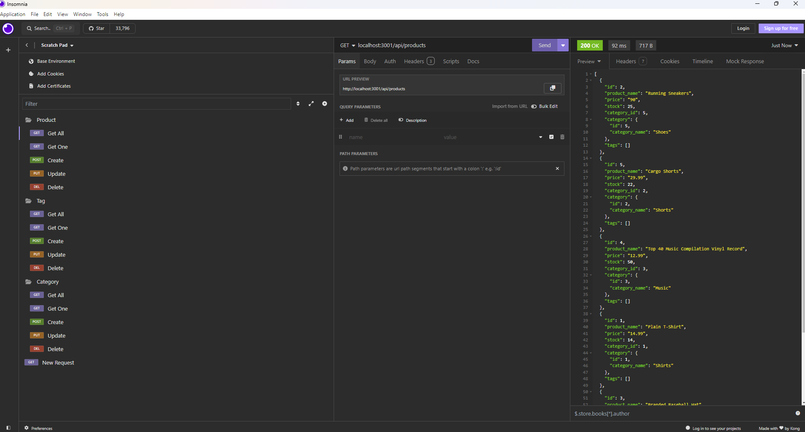

# e-commerce
by Heather Weltzien

## Table of Contents
* [Description](#description)
* [Installation](#installation)
* [Usage](#usage)
* [Credits](#credits)
* [License](#license)
    
## Description
   E-commerce uses PostgresSQL, Sequelize, and Node to provide a functional Express.js API. It is the back-end application for an e-commerce website. 

## Installation
    Run npm install and npm run seed in the terminal.
    
## Usage
    Run node server.js in the terminal. Test API routes in Insomnia Core to create, update, and delete data in the database.

# [link to walkthrough video](https://drive.google.com/file/d/1fGLJkHD6sqo2FtyVCLMmUc2gFUpatPyD/view)
    
## Credits
<ul>    
    <li>Tutoring session with Katie Redford</li>
    <li>Office hours with Erik Hirsch</li>
     <li>Office hours with Anthony Barragan</li>
        
</ul>    

## License
    none